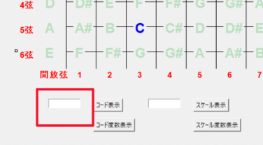
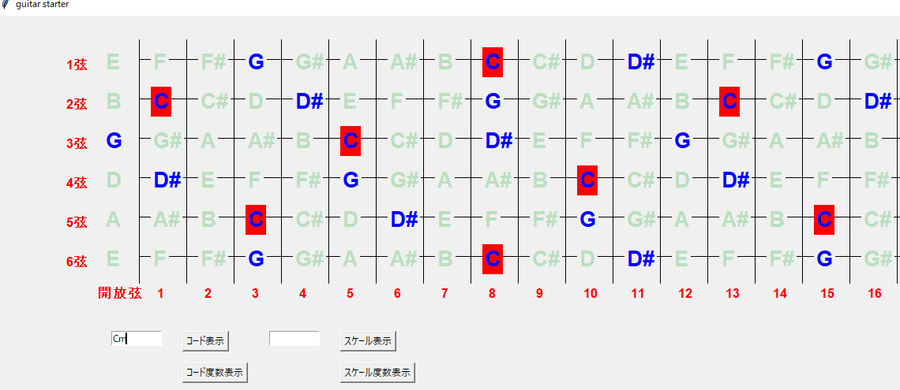
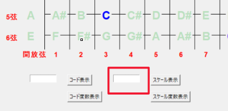

# ギター練習用アプリ
### 環境:python3系
- python標準のGUIライブラリであるtkinterを用いた簡単なアプリ。  
- ギターのコードやスケールを表示する。  
## ギターコードの出力
- 左の入力口に`Cm`などコードを打ち、コード表示のボタンをクリックすると、ルートとコード構成音に色がつく。 

- コードの入力には次の2つの ( ) から一つずつ取って入れることが可能。  
**(** C, C#, D, D#, E, F, F#, G, G#, A, A#, B **)** +   
**(** 6, 7, M7, 69, 79, add9, M79, m, m6, m7, mM7, m69, m79, madd9, mM79, -5, m-5, m7-5, sus4, sus2, aug, dim **)**
- `C7`, `F#m7`のように。Cメジャーコードは`C`のみでいい。
## スケールの出力
- 右の入力口にスケールを入力する。

- スケールの入力には次の2つの ( ) から一つずつ取って入れることが可能。  
**(** C, C#, D, D#, E, F, F#, G, G#, A, A#, B **)** +  
**(** M, m, m2, m3, Mpenta, mpenta **)**
- `CM`はCメジャースケールを表す。`m`は natural minor, harmonic minor, melodic minor の3つをそれぞれ `m`, `m2`, `m3` と書いている。

#### *スケール表示度数ボタン*
スケール度数表示と書かれたボタンはルートからの度数を表示してくれるが、画面を上書きしていくようにしてしまったので2度目以降文字が重なってしまう。
